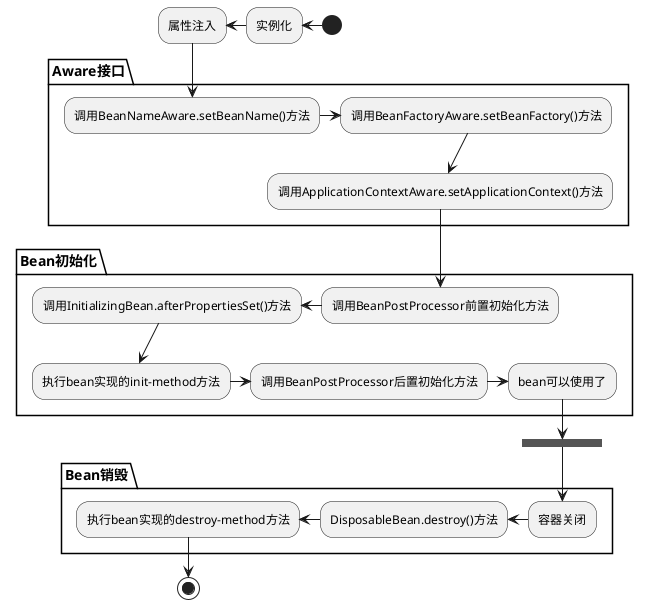

```plantuml
@startuml
(*) -left-> "实例化"
-left->"属性注入"
partition Aware接口 {
-->"调用BeanNameAware.setBeanName()方法"
-right->"调用BeanFactoryAware.setBeanFactory()方法"
-->"调用ApplicationContextAware.setApplicationContext()方法"
}
partition Bean初始化 {
-->"调用BeanPostProcessor前置初始化方法"
-left->"调用InitializingBean.afterPropertiesSet()方法"
-->"执行bean实现的init-method方法"
-right->"调用BeanPostProcessor后置初始化方法"
-right->"bean可以使用了"
}
-->=== code ===
partition Bean销毁 {
-->"容器关闭"
-left->"DisposableBean.destroy()方法"
-left->"执行bean实现的destroy-method方法"
}
--> (*)
@enduml
```